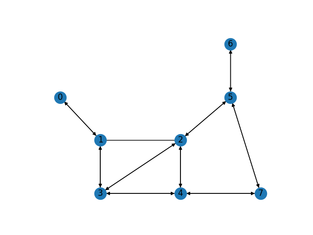

<!--
SPDX-FileCopyrightText: 2024 Marco Chiarandini <marco@imada.sdu.dk>

SPDX-License-Identifier: CC-BY-4.0
-->

# Instance Statistics

- 8 nodes 16 arcs of which 2 required and 1 alternative pairs required
- 115 total sum of lengths of the dead-head arcs available
- 21 total sum of lengths of the arcs and edges to salt
- 80 total required demand
- 50.0 total capacity
- 2 U-turn-allowed nodes

